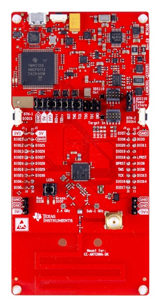

# Matter CC1352 CC2652 Pump Controller Example Application

An example application showing the use of [Matter][matter] on the Texas
Instruments CC13XX_26XX family of Wireless MCUs.

---

-   [Matter CC1352 CC2652 Pump Controller Example Application](#matter-cc1352-cc2652-pump-controller-example-application)
    -   [Introduction](#introduction)
        -   [Device UI](#device-ui)
    -   [Building](#building)
        -   [Preparation](#preparation)
        -   [Compilation](#compilation)
    -   [Programming](#programming)
        -   [UniFlash](#uniflash)
        -   [Code Composer Studio](#code-composer-studio)
    -   [Viewing Logging Output](#viewing-logging-output)
    -   [Running the Example](#running-the-example)
        -   [Provisioning](#provisioning)
            -   [Bluetooth LE Advertising](#bluetooth-le-advertising)
            -   [Bluetooth LE Rendezvous](#bluetooth-le-rendezvous)
        -   [Matter Remote Commands](#matter-remote-commands)
    -   [TI Support](#ti-support)

---

## Introduction



The CC13XX_26XX pump controller example application provides a working
demonstration of a connected pump controller device. This uses the open-source
Matter implementation and the Texas Instruments SimpleLink™ CC13XX and CC26XX
software development kit.

This example is enabled to build for CC2652R7 devices.

The pump example is intended to serve both as a means to explore the workings of
Matter, as well as a template for creating real products based on the Texas
Instruments devices.

## Device UI

This example application has a simple User Interface to depict the state of the
pump and to control the state. The user LEDs on the LaunchPad are set on when
the pump is started, and are set off when stopped. The LEDs will flash when in
the transition state between started and stopped.

Short presses (less than 1000ms) of the right user button (`BTN-2`) are used for
toggling the pump state.

Short presses (less than 1000ms) of the left user button (`BTN-1`) are used for
toggling Matter BLE advertisements.

Long presses (greater than 5000ms) of the left user button (`BTN-1`) will
initiate a factory reset of the device clearing all stored provisioning
information to allow for a new network setup.

## Building

### Preparation

Some initial setup is necessary for preparing the build environment. This
section will need to be done when migrating to new versions of the SDK. This
guide assumes that the environment is linux based, and recommends Ubuntu 20.04.

-   Download and install [SysConfig][sysconfig] ([recommended
    version][sysconfig_recommended]). This can be done simply with the following
    commands.

    ```
    $ cd ~
    $ wget https://dr-download.ti.com/software-development/ide-configuration-compiler-or-debugger/MD-nsUM6f7Vvb/1.14.0.2667/sysconfig-1.14.0_2667-setup.run
    $ chmod +x sysconfig-1.14.0_2667-setup.run
    $ ./sysconfig-1.14.0_2667-setup.run
    ```

-   Run the bootstrap script to setup the build environment.

    ```
    $ cd ~/connectedhomeip
    $ source ./scripts/bootstrap.sh

    ```

### Compilation

It is necessary to activate the environment in every new shell. Then run GN and
Ninja to build the executable.

-   Activate the build environment with the repository activate script.

    ```
    $ cd ~/connectedhomeip
    $ source ./scripts/activate.sh

    ```

-   Run the build to produce a default executable. By default on Linux both the
    TI SimpleLink SDK and Sysconfig are located in a `ti` folder in the user's
    home directory, and you must provide the absolute path to them. For example
    `/home/username/ti/sysconfig_1.14.0`. On Windows the default directory is
    `C:\ti`. Take note of this install path, as it will be used in the next
    step.

    ```
    $ cd ~/connectedhomeip/examples/pump-controller-app/cc13x2x7_26x2x7
    $ gn gen out/debug --args="ti_sysconfig_root=\"$HOME/ti/sysconfig_1.14.0\""
    $ ninja -C out/debug

    ```

## Programming

Loading the built image onto a LaunchPad is supported through two methods;
Uniflash and Code Composer Studio (CCS). UniFlash can be used to load the image.
Code Composer Studio can be used to load the image and debug the source code.

### UniFlash

[Programming UniFlash](doc/programming-uniflash.md)

### Code Composer Studio

[Programming and Debugging with CCS](doc/programming-ccs.md)

## Viewing Logging Output

By default the log output will be sent to the Application/User UART. Open a
terminal emulator to that port to see the output with the following options:

| Parameter    | Value    |
| ------------ | -------- |
| Speed (baud) | `115200` |
| Data bits    | `8`      |
| Stop bits    | `1`      |
| Parity       | `None`   |
| Flow control | `None`   |

## Running the Example

Once a device has been flashed with this example, it can now join and operate in
an existing Thread network. The following sections assume that a Thread network
is already active, and has at least one [OpenThread Border
Router][ot_border_router_setup].

### Provisioning

The first step to bring the Matter device onto the network is to provision it.
Our example accomplishes this with Bluetooth Low Energy (BLE) and the
[CHIPTool](../../../examples/android/CHIPTool/README.md) mobile app.

#### Bluetooth LE Advertising

To provision this example onto a Thread network, the device must be discoverable
over Bluetooth LE. BLE advertising is started by pressing the right button (less
than 1000ms), labeled `BTN-2` on the silkscreen. Once the device is fully
provisioned, BLE advertising will stop.

#### Bluetooth LE Rendezvous

In this example, the provisioning procedure (called Rendezvous) is done over
Bluetooth LE between a Matter device (pump-controller-app) and the Matter
controller (CHIPTool), where the controller has the commissioner role.

To start the rendezvous, the controller must get the commissioning information
from the Matter device.

This is done by scanning a QR code. A URL will be displayed on the pump-app's
log ([UART terminal](#viewing-logging-output)). It will look like the following:

```
SetupQRCode:  [MT:.81TM -00 0C9SS0]
Copy/paste the below URL in a browser to see the QR Code:
https://project-chip.github.io/connectedhomeip/qrcode.html?data=CH%3A.81TM%20-00%200C9SS0
```

You can directly navigate to the webpage URL displayed (which has QR payload
pre-loaded). Alternatively, you can navigate to [the QR code
generator][qr_code_generator] and enter in the payload shown in `SetupQRCode`
(in this case `MT:.81TM -00 0C9SS0`).

### Matter Remote Commands

Once the Matter device is provisioned and operating on the network, CHIPTool can
be used to control the device. During the provisioning process, the Matter
device would have sent one of its newly assigned IPv6 addresses to the CHIPTool.

In the app, you should see an On/Off cluster; this corresponds to the pump-app.
You can now control the pump-controller-app Matter device from the smartphone!

## TI Support

For technical support, please consider creating a post on TI's [E2E forum][e2e].
Additionally, we welcome any feedback.

[matter]: https://github.com/project-chip/connectedhomeip
[cc1352r1_launchxl]: https://www.ti.com/tool/LAUNCHXL-CC1352R1
[e2e]: https://e2e.ti.com/support/wireless-connectivity/zigbee-and-thread
[sysconfig]: https://www.ti.com/tool/SYSCONFIG
[sysconfig_recommended]:
    https://dr-download.ti.com/software-development/ide-configuration-compiler-or-debugger/MD-nsUM6f7Vvb/1.14.0.2667/sysconfig-1.14.0_2667-setup.run
[ti_thread_dnd]:
    https://www.ti.com/wireless-connectivity/thread/design-development.html
[ot_border_router_setup]:
    https://openthread.io/guides/border-router/beaglebone-black
[qr_code_generator]: https://project-chip.github.io/connectedhomeip/qrcode.html
